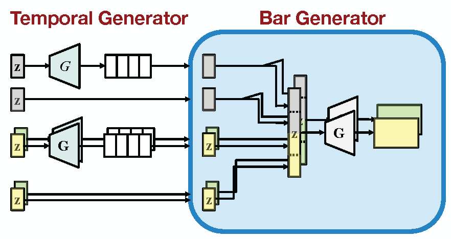
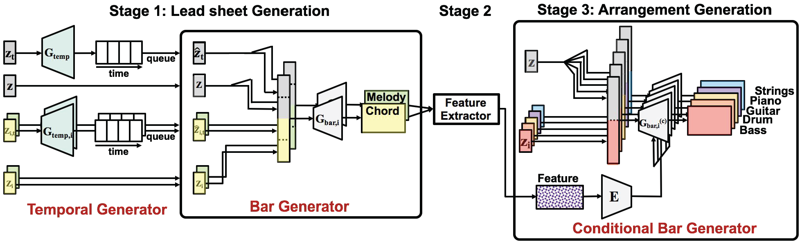
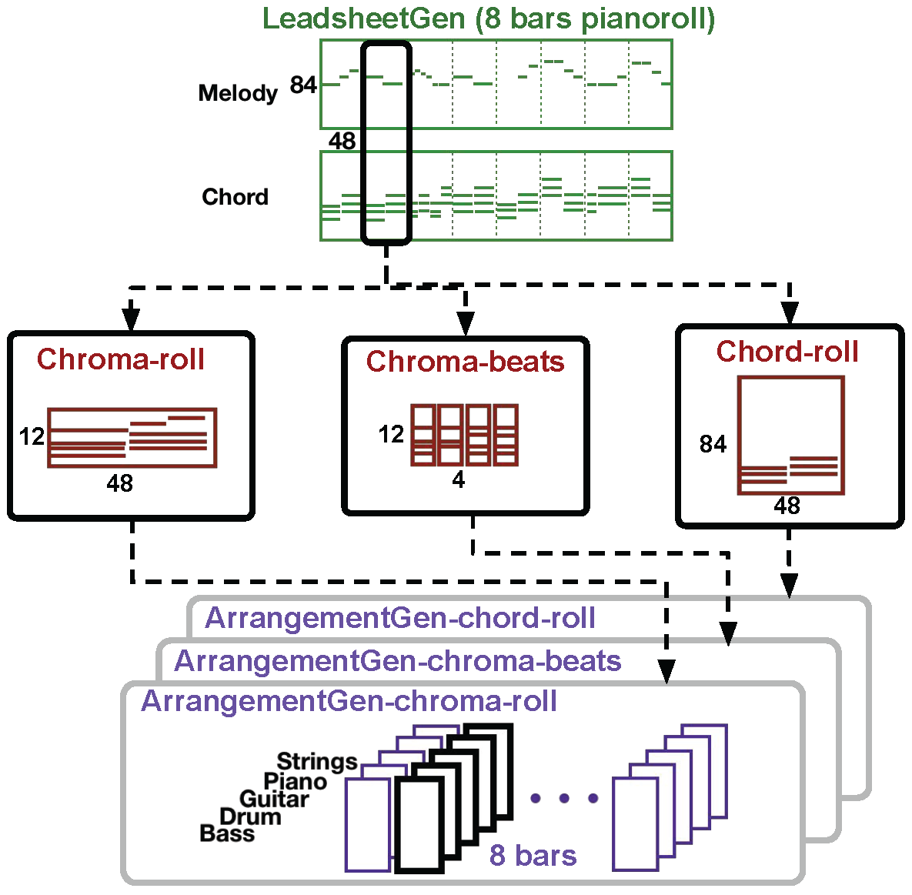

# Model

## Lead Sheet Generation
- Eight-bar generation
- Recurrent Convolutional GAN (RCNN GAN)
- Pianoroll form for both melody and chord representation

## Arrangement Generation
- Conditional bar generation
- Convolutional Generative Adversarial Network (CNN GAN)
- Piano-rolls of one bar long for each track representation
- Conditional generation is done by a convolutional encoder to embed harmonic features
- Five tracks for the arrangement: Strings, Piano, Guitar, Drum, Bass

## Symbolic-domain harmonic features
- **Chroma pianoroll representation** compresses the pitch range into chroma, leading to a 12 x 48 matrix per bar.
- **Chroma beats representation** further reduces the temporal resolution of chroma-roll by taking the average per beat, leading to a 12 x 4 matrix per bar.
- **Chord pianoroll representation** applies an existing chord recognition model [4] for chord estimation to recognize major and minor chords for each beat and then uses a piano roll to represent the chords, yielding an 84 x 48 matrix per bar.

## System Flow

