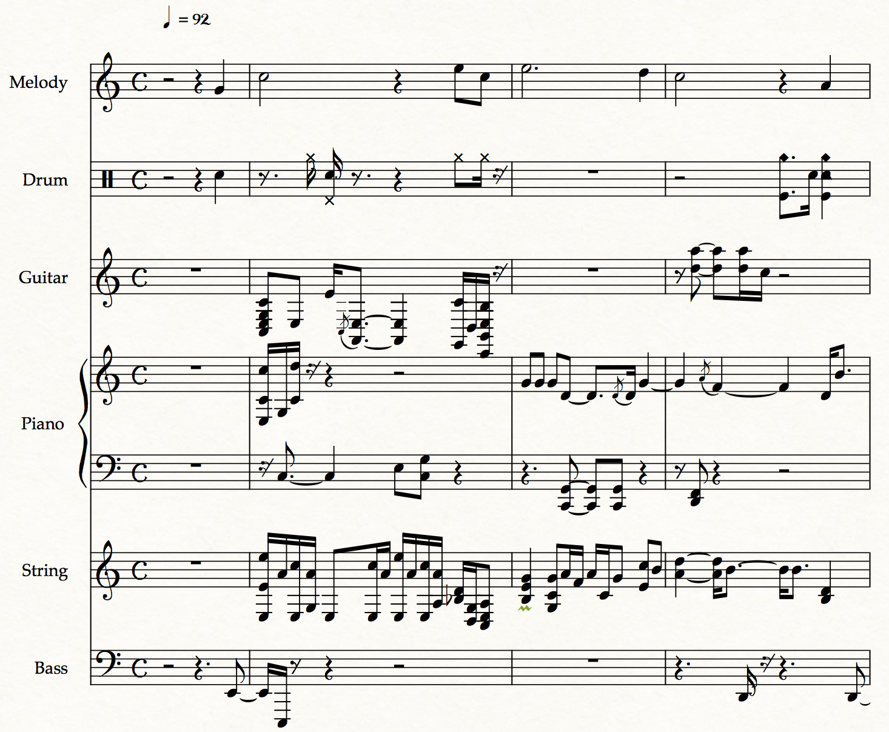

# Results
## Lead Sheet Generation Demo
### Convolutional GAN version
sample1 
sample2 
sample3 
sample4 
sample5 
sample6 

### Recurrent VAE version

vae 4-bar samples

sample 

vae 8-bar samples

sample 

#### interpolation of two pop songs
**from "Hey Jude" to "Some one like you"**

**from "Payphone" to "Hey Jude"**



## Arrangement Generation Demo

Arrangement on theorytab leadsheets

| Model          | Sample1 |
|:--------------:|:-------:|
| *chord-roll*   |  |
| *chroma-roll*  |  |
| *chroma-beats* |  |

| Model          | Sample2 |
|:--------------:|:-------:|
| *chord-roll*   |  |
| *chroma-roll*  |  |
| *chroma-beats* |  |

| Model          | Sample3 |
|:--------------:|:-------:|
| *chord-roll*   |  |
| *chroma-roll*  |  |
| *chroma-beats* |  |

| Model          | Sample4 |
|:--------------:|:-------:|
| *chord-roll*   |  |
| *chroma-roll*  |  |
| *chroma-beats* |  |

Arrangement on VAE generated leadsheets



## Arrangement visualization


The music sheet of Amazing grace arrangement

